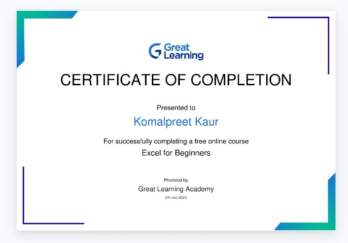

# Komalai.github.io
# MY INTRODUCTION
My name is Komalpreet kaur.I belongs to Malerkotla. I have recently completed my 12th standard from Islamia girls sr. sec. school,Malerkotla.I have completed my 10th standard from Ramgarhia public school, Malerkotla.

#My 10th class's marksheet 

|Subject| Marks obtained| Total marks|
|-------|---------------|------------|
|Punjabi| 128|150|
|English|97|100|
|Hindi|74|100|
|Mathematics|67|100|
|Science|85|100|
|Social Studies|82|100|
|Computer Science|89|100|
|Welcome Life|100|100|
|Agriculture|100|100|
|Overall grade |A|
|Result|Pass|
|Grand Total|533|650|

#My 12th class's marksheet

|Subject| Marks obtained| Total marks|
|-------|---------------|------------|
|Punjabi| 87|100|
|English|90|100|
|Physics|88|100|
|Chemistry|90|100|
|Mathematics|64|100|
|Environmental Studies|50|50|
|Computer Science| 89|100|
|Overall grade|A|
|Result|Pass|
|Grand Total|419|500|

# MY EXCEL CERTIFICATE 

# Date :-10/07/24
# Induction program 

first day of college and first day of induction program firstly there was ardaas kirtan in college's Gurudwara Sahib for our better future it was the first thing that we hava done on our first day which was sending prayers to our almighty . then there we have refreshments then acter refreshments their was an auditorium session which was about college's history and successfull students who are graduated from GNE college.There Mr. Rajeshwar Singh sidhu ,Mr. Jeewandeep Singh were invited as guest of honour to motivate and guide us for our new journey.

# Date :- 11/07/24
# Induction program

Day second for our college . On our second day of college there was an auditorium sesion . Firstly our session was conducted by Mr. Arvind dhingra sir sir is incharge of TAC.sir was fully confident and he delivered as a great lecture. then the session was conducted by Dr. Parminder Singh sir he have thought us about variour scholarships and student club variety available in our college.Then further session was conducted by Dr. HS rai sir.

# Date :- 12/07/24
# Induction program

Day 3 of induction program today their were our classes. First class was of mathematics in which we have a huge discussion on basics of mathematics important topic integral, derivatives, differentiability,etc. Then our second class was of UHV which was conducted by Manjot kaur mam . As this subject was totally new to us . Nobody knows about it but our mentor had explained it so well.Lecture was about Human Values. 

# Date :- 15/07/24
# Induction program

Day 4 of our college and induction program  Today was a motivational auditorium session which was conducted by Mr. Randhir singh sir ,Dr.Pyare Lal,Mr. Sony Goyal and then the session was conducted by fourth year mechanical department's student of our college who have explained us about and how communication skills matter in our life and he also taught us about how we can improve our communication skills.

# Date :- 17/07/24
# Induction program

Day 6 of induction program today their were our classes. First class was of mathematics in which we have a huge discussion on basics of mathematics important topic integral, derivatives, differentiability,etc and we have practised some examples related to our topic. Then our second class was of UHV. here we have discussed our second chapter of UHV.

# Date :- 18/07/24
# Induction program

Day 7 first session was of pear intersection which was conducted by our senior who is studying in CSE second year. He had taugh is about our college history snd about the marks distribution,various scholarships,bus pass, library pass ,etc.Then our next class was of mathematics then further we have an auditorium session about NSS and NCC that on which motto they works on and how we can become a part of NCC ans NSS.

# Date :- 19/07/24
# Induction program

Day 8 of induction program 

# Date :- 24/07/24
# Induction program

Hello! In today's auditorium session our induction program startes on the exect timming as decleared in the time table . Today's first the speaker was mr. Gauravdeep Singh sir.He told us about his failer in his life and about his learnings that he had learned from his downs.And then he shared the information about his success and his achievements that he was honnered with national award in 2018. He teach us tht how we can transform ourself by just loving ourself and having believe in ourself.Then there was break from 12:30 to 1:30.Then the other speakers arrived.
who were Yuvraj Singh sir and Lakhwinder
singh sir qho have told us about NPTEL which stands for National Programme on Technology Enchanced Learning which is under CML, center of multi-faceted learning. The organs of CML are NPTELand skill and personality development.And how we can achieve  success by maintaining our passion with studies.Then further we have lecture on topic cosmic club their our seriors have shared knowledge about cosmic club and how we can be a member of this club. And why we should join this club.
Then some students have showed their talent . Overall today I have learned a lot of new things that how I can transform myself and how I can develop my personality.

# Date :- 25/7/23
# Indiction program

Today our first class qas of UHV which was conducted by Manjot kaur mam.firstly we have a discussion on our previous chapters. Then further we discussed our next chapter which is Understanding harmony with family Then our class ended at 11:30. Then our class is of Canva in which we have studied the intro of canva and how to use canva for making tamples, presentations,etc. using canva.Oir seniors taught us very politely and in a decent way.then their was break from 12:30 to 1:30.Then in the next lecture their was pur maths test in which we have done well.

Today our first class was of UHV which was conducted by Manjot kaur mam.Firstly in class we have a discussion on our perivious chapter then we discussed our next chapter which is understanding harmony in the family.She taught us about human relationships with others and human brings feelings.the we have a break for 15 min.Then our other class of canva starts at 

